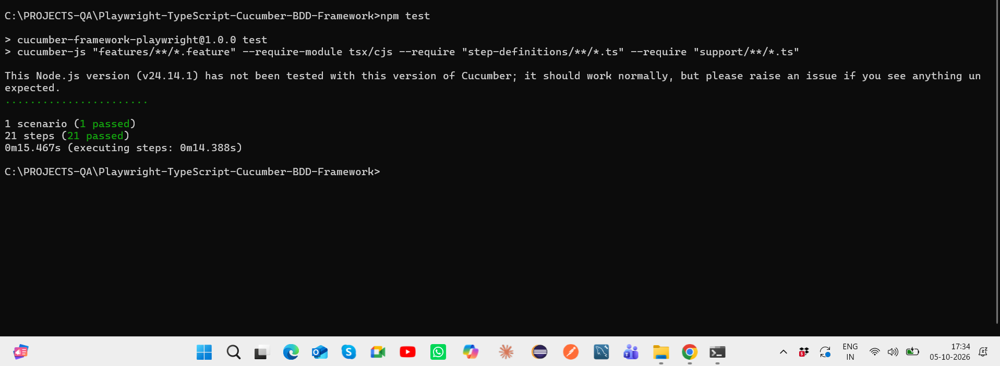
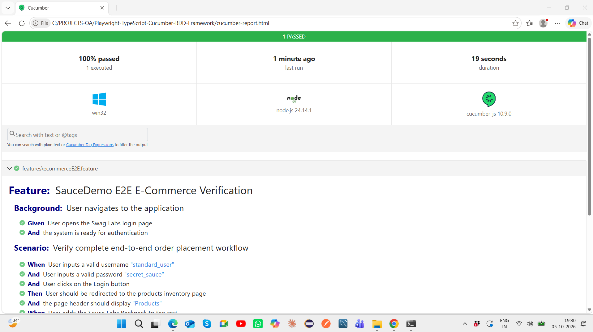
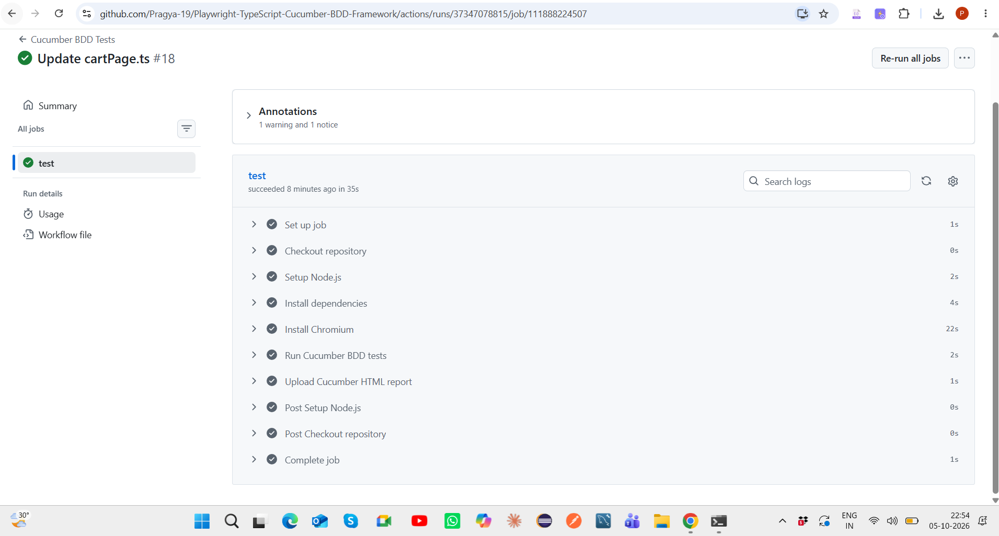

# Playwright TypeScript Cucumber BDD Framework

[](https://github.com/Pragya-19/Playwright-TypeScript-Cucumber-BDD-Framework/actions/workflows/playwright.yml)

End-to-end BDD automation framework built using **Playwright, TypeScript, Cucumber, Page Object Model, hooks, step definitions, HTML reporting, and GitHub Actions CI/CD**.

## Project Objective

This project demonstrates a maintainable Behavior Driven Development automation framework for validating a complete SauceDemo e-commerce workflow.

The framework separates business-readable Gherkin scenarios from automation implementation using step definitions and reusable Page Object classes.

## Tech Stack

- Playwright
- TypeScript
- Cucumber / Gherkin
- Page Object Model
- Node.js / npm
- Git & GitHub
- GitHub Actions
- Cucumber HTML Reporter

## Framework Structure

```text
Playwright-TypeScript-Cucumber-BDD-Framework
│
├── .github/
│   └── workflows/
│       └── playwright.yml
│
├── data/
│
├── docs/
│   └── screenshots/
│       ├── cucumber-terminal-21-steps-passed.png
│       ├── cucumber-html-report-passed.png
│       └── github-actions-bdd-ci-passed.png
│
├── features/
│   └── ecommerceE2E.feature
│
├── pages/
│   ├── LoginPage.ts
│   ├── InventoryPage.ts
│   ├── CartPage.ts
│   └── CheckoutPage.ts
│
├── step-definitions/
│   ├── loginStep.ts
│   ├── inventoryStep.ts
│   ├── cartStep.ts
│   └── checkoutStep.ts
│
├── support/
│   └── hooks.ts
│
├── .gitignore
├── package.json
├── package-lock.json
├── playwright.config.ts
└── README.md
```

## BDD Architecture

```text
Feature File
    ↓
Gherkin Scenario
    ↓
Step Definitions
    ↓
Page Object Model
    ↓
Playwright Browser Automation
    ↓
Assertions
    ↓
Before / After Hooks
    ↓
Cucumber HTML Report
    ↓
GitHub Actions CI
```

## Scenario Covered

The current end-to-end SauceDemo scenario validates the complete purchase workflow:

1. Navigate to the application
2. Login with valid credentials
3. Validate the products inventory page
4. Add multiple products to the cart
5. Validate the cart badge
6. Navigate to the shopping cart
7. Validate selected cart items
8. Proceed to checkout
9. Enter customer information
10. Validate the checkout overview
11. Complete the purchase
12. Validate the order confirmation

## Running the Project

Install dependencies:

```bash
npm install
```

Install Chromium:

```bash
npx playwright install chromium
```

Run the complete Cucumber BDD suite:

```bash
npm test
```

The test command executes the Gherkin feature through the TypeScript step definitions and generates the Cucumber HTML report.

## Execution Status

- **1 end-to-end scenario**
- **21 BDD steps**
- **21/21 steps passing**
- **0 failed**
- **0 undefined**
- **100% scenario execution success**
- **GitHub Actions CI passing**

## Execution Evidence

### Local BDD Execution

The SauceDemo end-to-end BDD workflow executes successfully with all 21 steps passing.



### Cucumber HTML Report

The generated Cucumber HTML report provides business-readable execution results for the complete scenario.



### GitHub Actions CI

The BDD suite executes successfully in a clean Ubuntu environment using GitHub Actions.



The CI pipeline:

- Sets up Node.js 22
- Installs project dependencies
- Installs Chromium
- Executes the Cucumber BDD suite
- Uploads the generated HTML report as a workflow artifact

## CI Design

Local execution uses a visible Chromium browser with slow motion for easier observation during development.

In GitHub Actions, the framework automatically switches to **headless execution with no artificial delay**, making CI execution faster and suitable for Linux runners.

The framework also uses Playwright web-first assertions such as `toHaveCount()` to avoid timing-dependent failures between local and CI environments.

## Key Concepts Demonstrated

- Behavior Driven Development
- Gherkin Given / When / Then scenarios
- Cucumber step definitions
- Playwright with TypeScript
- Page Object Model
- Before / After hooks
- Reusable browser and page setup
- Web-first assertions and auto-waiting
- End-to-end workflow automation
- Cucumber HTML reporting
- GitHub Actions CI/CD
- Headless CI execution
- Test artifact generation
